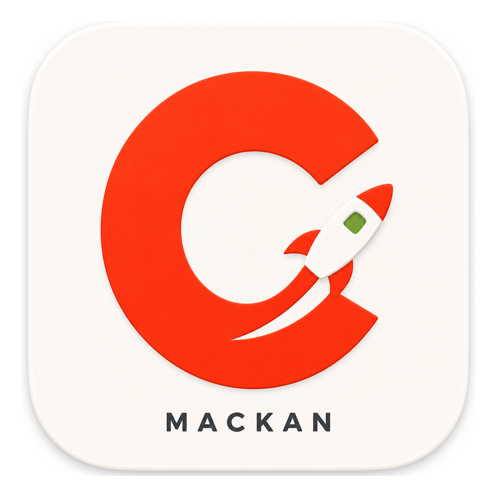

# MACKAN

MACKAN is a native macOS app for managing Kerbal Space Program mods with CKAN.
It keeps CKAN Core as the source of truth for metadata, dependency resolution,
downloads, installs, exports, registry locking, and compatibility decisions,
while replacing the Terminal-launched macOS ConsoleUI path with a SwiftUI/AppKit
desktop app.



## Status

MACKAN is a public-preview fork direction, not an official CKAN release.

- Native macOS UI: in active development.
- CKAN Core compatibility: preserved through a .NET sidecar that calls CKAN Core
  directly.
- Local app bundle and DMG packaging: available for engineering checks.
- Signed/notarized public DMG: not ready until Developer ID signing,
  hardened runtime, notarization, stapling, checksums, and release provenance
  gates are completed.
- Upstream CKAN CLI/GUI/NetKAN code is still present because MACKAN is built on
  top of the CKAN codebase.

## What Works

Current native MACKAN coverage includes:

- Instance management: add, clone, fake dev/test instances, rename, set default,
  forget/remove, reveal in Finder, edit launch options, and launch.
- Repository management: list, add, remove, reorder, refresh, canonical source
  selection, progress, and recoverable download failures.
- Catalog workflows: full module list, Windows-style smart filters, metadata
  tags, scoped token search, saved searches, labels, persisted table columns,
  multi-column sorting, auto-installed toggles, and native inspector tabs.
- Change sets: install, remove, upgrade, replace, provider alternatives,
  recommendations, conflicts, async apply/status/cancel, retry, and typed error
  recovery.
- File workflows: install local `.ckan` files, import manual downloads, export
  mod lists, and export `.ckan` modpacks.
- Maintenance and settings: unmanaged file scan/list, history, play time,
  download statistics, cache cleanup, deduplication, registry repair,
  compatibility, stability, preferred hosts, install filters, launch settings,
  and auth tokens stored through macOS Keychain.
- Diagnostics and packaging: sidecar health/version contracts, diagnostics
  bundles, local app bundle generation, local DMG packaging, bundle verification,
  launch smoke checks, and release-readiness scripts.

The detailed parity status is tracked in
[docs/mackan/parity-matrix.md](docs/mackan/parity-matrix.md).

## Download Preview App

The latest public preview app is published on GitHub Releases:

- [Download MACKAN preview](https://github.com/iKoles-dev/MACKAN/releases/tag/mackan-preview)

Download `MACKAN-*-macOS.app.zip`, unzip it, and open `MACKAN.app`.

This preview archive is built by GitHub Actions for convenience. It is
ad-hoc signed but not Developer ID signed or notarized yet, so macOS Gatekeeper
may still show a warning. If a normal double-click is blocked, use Finder
right-click -> Open. A signed and notarized DMG remains a separate release gate.

## Run Locally

Build and open a local development app bundle:

```bash
APP_PATH="$(macosx/MACKAN/scripts/build-dev-app.sh)"
open "$APP_PATH"
```

Build a local universal DMG:

```bash
DMG_PATH="$(macosx/MACKAN/scripts/package-dmg.sh --universal)"
open "$(dirname "$DMG_PATH")"
```

Run the non-credential release gate:

```bash
macosx/MACKAN/scripts/release-check.sh --skip-launch
```

Run a launch smoke check against the staged app:

```bash
macosx/MACKAN/scripts/verify-app-launch.sh --timeout 25 \
    "$HOME/Library/Caches/MACKAN/build/MACKAN.app"
```

## Development Docs

Public-facing MACKAN planning and implementation docs:

- [MACKAN overview](docs/mackan/README.md)
- [Architecture](docs/mackan/architecture.md)
- [Product spec](docs/mackan/product-spec.md)
- [Parity matrix](docs/mackan/parity-matrix.md)
- [Release roadmap](docs/mackan/release-roadmap.md)
- [Release execution checklist](docs/mackan/release-execution-checklist.md)

Some older files under `docs/mackan` are implementation evidence or planning
snapshots. They are useful for audits, but the documents above are the intended
public entry points.

## Relationship To CKAN

MACKAN is built from a fork of the
[KSP-CKAN/CKAN](https://github.com/KSP-CKAN/CKAN) codebase.
CKAN Core remains the compatibility and mod-management engine. MACKAN adds a
native macOS application and sidecar contracts around that engine.

Useful upstream CKAN links:

- [CKAN user guide](https://github.com/KSP-CKAN/CKAN/wiki/User-guide)
- [CKAN metadata specification](Spec.md)
- [CKAN wiki](https://github.com/KSP-CKAN/CKAN/wiki)
- [CKAN issues](https://github.com/KSP-CKAN/CKAN/issues)
- [NetKAN metadata issues](https://github.com/KSP-CKAN/NetKAN/issues)

## Contributing

See [CONTRIBUTING.md](CONTRIBUTING.md) for the current contribution model.

For MACKAN work, keep changes inside the established boundary:

- SwiftUI/AppKit owns the native UI, macOS integration, and presentation state.
- `MACKAN.Service` owns JSON-RPC contracts that call CKAN Core.
- CKAN Core remains the source of truth for mod metadata, dependency
  resolution, registry mutation, downloads, installation, and exports.

## Attribution

CKAN is developed by the CKAN project and contributors. MACKAN is an
independent fork direction for a native macOS UI and is not an official CKAN,
Squad, Private Division, Take-Two, or Kerbal Space Program product.

Kerbal Space Program and related marks belong to their respective owners.

See [NOTICE.md](NOTICE.md) and [LICENSE.md](LICENSE.md).
