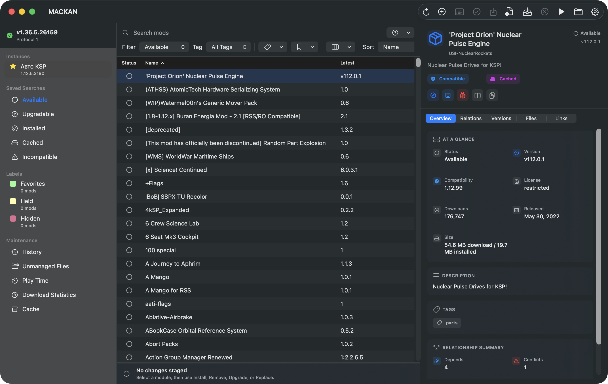

# MACKAN

Native macOS CKAN mod management for Kerbal Space Program.

MACKAN gives Mac players a desktop CKAN experience built with SwiftUI/AppKit,
while CKAN Core remains the engine for metadata, dependency resolution,
downloads, installs, exports, registry locking, and compatibility decisions.

[](https://github.com/iKoles-dev/MACKAN/actions/workflows/pages.yml)
[](https://github.com/iKoles-dev/MACKAN/actions/workflows/mackan-preview-release.yml)
[](https://github.com/iKoles-dev/MACKAN/releases/tag/mackan-preview)
[](https://ikoles-dev.github.io/MACKAN/)



## Quick Links

- [Download preview app](https://github.com/iKoles-dev/MACKAN/releases/tag/mackan-preview)
- [Install the preview](INSTALL.md)
- [Open the website](https://ikoles-dev.github.io/MACKAN/)
- [Report preview feedback](https://github.com/iKoles-dev/MACKAN/issues/new/choose)
- [Troubleshooting](docs/mackan/troubleshooting.md)
- [Diagnostics and privacy](docs/mackan/diagnostics-privacy.md)
- [Read the release checklist](docs/mackan/release-execution-checklist.md)
- [Check feature parity](docs/mackan/parity-matrix.md)

## Preview Status

MACKAN is a public preview fork direction, not an official CKAN release.

| Area | Status |
| --- | --- |
| Native macOS UI | Active preview development |
| CKAN Core behavior | Preserved through a .NET sidecar |
| Preview `.app` archive | Published from GitHub Actions |
| Signed public DMG | Blocked on Developer ID signing and notarization |
| Upstream CKAN code | Still present because MACKAN builds on CKAN |

The current preview is intended for Mac testers who are comfortable opening an
ad-hoc signed app. A signed and notarized DMG remains a release gate.

## Download The Preview

1. Download `MACKAN-preview-macOS.app.zip` and the matching `.sha256` file from
   the [MACKAN Preview release](https://github.com/iKoles-dev/MACKAN/releases/tag/mackan-preview).
2. Verify the checksum.
3. Unzip the archive.
4. Open `MACKAN.app`.
5. If macOS Gatekeeper blocks a normal double-click, use Finder right-click,
   then Open. On newer macOS versions you may need System Settings ->
   Privacy & Security -> Open Anyway.

See [INSTALL.md](INSTALL.md) for the full install and checksum flow.

## What You Can Test

Current native MACKAN coverage includes:

- **Instances:** add, clone, rename, set default, forget/remove, reveal in
  Finder, edit launch options, and launch KSP.
- **Repositories:** list, add, remove, reorder, refresh, select canonical
  sources, track progress, and recover from download failures.
- **Catalog:** browse the full module list, use smart filters, search metadata,
  save searches, manage labels, sort table columns, and inspect module details.
- **Change sets:** install, remove, upgrade, replace, review provider
  alternatives and recommendations, apply operations, retry, cancel, and recover
  from typed errors.
- **Files:** install local `.ckan` files, import manual downloads, export mod
  lists, and export `.ckan` modpacks.
- **Maintenance:** scan unmanaged files, view history/play time/download stats,
  clean cache, deduplicate downloads, repair registry state, configure
  compatibility/stability/hosts/filters, and store auth tokens in Keychain.
- **Diagnostics:** check sidecar health, collect diagnostics bundles, build local
  app bundles and DMGs, verify bundles, and run launch smoke checks.

Detailed parity is tracked in [docs/mackan/parity-matrix.md](docs/mackan/parity-matrix.md).

## Run Locally

Build and open a local development app bundle (always in repo build folder):

```bash
APP_PATH="$(macosx/MACKAN/scripts/build-dev-app.sh)"
open "$APP_PATH"
```

Build a local universal DMG (artifacts also in repo build folder):

```bash
DMG_PATH="$(macosx/MACKAN/scripts/package-dmg.sh --universal)"
open "$(dirname "$DMG_PATH")"
```

Quick one-liners from repo root:

```bash
make run                # build + launch app
make run-universal      # build universal + launch app
make app                # build app (prints path)
make dmg                # build and open DMG (single-arch sidecar)
make dmg-universal      # build and open universal DMG
make launcher           # build no-terminal AppleScript launcher app
make run-gui            # run AppleScript launcher (build + launch, no console)
make run-gui-universal  # run launcher with universal build (no console)
make clean              # remove build artifacts from default $(BUILD_ROOT)
make clean-staging      # remove staging folder with MACKAN.Service publish artifacts only
make path               # print default app path
```

No-terminal usage:

```bash
make launcher                 # creates ./.build/mackan-app/launchers/MACKAN-Launcher.app
open ./.build/mackan-app/launchers/MACKAN-Launcher.app
```

After that, you can always start the app from Finder by double-clicking the launcher in `.build/mackan-app` (no Terminal window).

If you need custom install options, use:

```bash
MACKAN_SELF_CONTAINED=false APP_NAME=MyMACKAN make run
```

Default behavior also auto-removes staging sidecar publish output after each build/launch/dmg action.

Run the non-credential release gate:

```bash
macosx/MACKAN/scripts/release-check.sh --skip-launch
```

Run a launch smoke check against the staged app:

```bash
macosx/MACKAN/scripts/verify-app-launch.sh --timeout 25 \
    ".build/mackan-app/MACKAN.app"
```

## Development Docs

Public-facing MACKAN planning and implementation docs:

- [MACKAN overview](docs/mackan/README.md)
- [Architecture](docs/mackan/architecture.md)
- [Product spec](docs/mackan/product-spec.md)
- [Parity matrix](docs/mackan/parity-matrix.md)
- [Install guide](INSTALL.md)
- [Troubleshooting](docs/mackan/troubleshooting.md)
- [Diagnostics and privacy](docs/mackan/diagnostics-privacy.md)
- [Release roadmap](docs/mackan/release-roadmap.md)
- [Release execution checklist](docs/mackan/release-execution-checklist.md)
- [Community launch copy](docs/mackan/community-launch-copy.md)
- [GitHub repository settings](docs/mackan/github-repository-settings.md)

Some older files under `docs/mackan` are implementation evidence or planning
snapshots. They are useful for audits, but the documents above are the intended
public entry points.

## Relationship To CKAN

MACKAN is built from a fork of the
[KSP-CKAN/CKAN](https://github.com/KSP-CKAN/CKAN) codebase.
CKAN Core remains the compatibility and mod-management engine. MACKAN adds a
native macOS application and sidecar contracts around that engine.

Useful upstream CKAN links:

- [CKAN user guide](https://github.com/KSP-CKAN/CKAN/wiki/User-guide)
- [CKAN metadata specification](Spec.md)
- [CKAN wiki](https://github.com/KSP-CKAN/CKAN/wiki)
- [CKAN issues](https://github.com/KSP-CKAN/CKAN/issues)
- [NetKAN metadata issues](https://github.com/KSP-CKAN/NetKAN/issues)

## Contributing

See [CONTRIBUTING.md](CONTRIBUTING.md) for the current contribution model.

For MACKAN work, keep changes inside the established boundary:

- SwiftUI/AppKit owns the native UI, macOS integration, and presentation state.
- `MACKAN.Service` owns JSON-RPC contracts that call CKAN Core.
- CKAN Core remains the source of truth for mod metadata, dependency
  resolution, registry mutation, downloads, installation, and exports.

## Attribution

CKAN is developed by the CKAN project and contributors. MACKAN is an
independent fork direction for a native macOS UI and is not an official CKAN,
Squad, Private Division, Take-Two, or Kerbal Space Program product.

Kerbal Space Program and related marks belong to their respective owners.

See [NOTICE.md](NOTICE.md) and [LICENSE.md](LICENSE.md).
